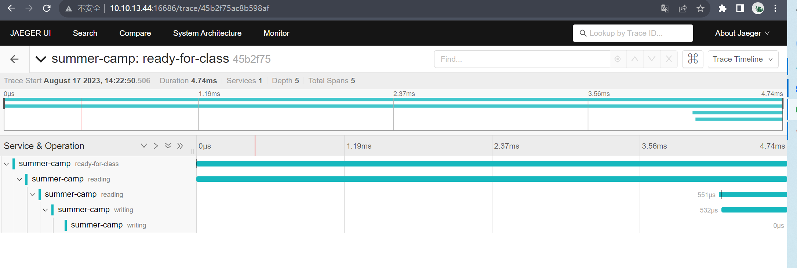
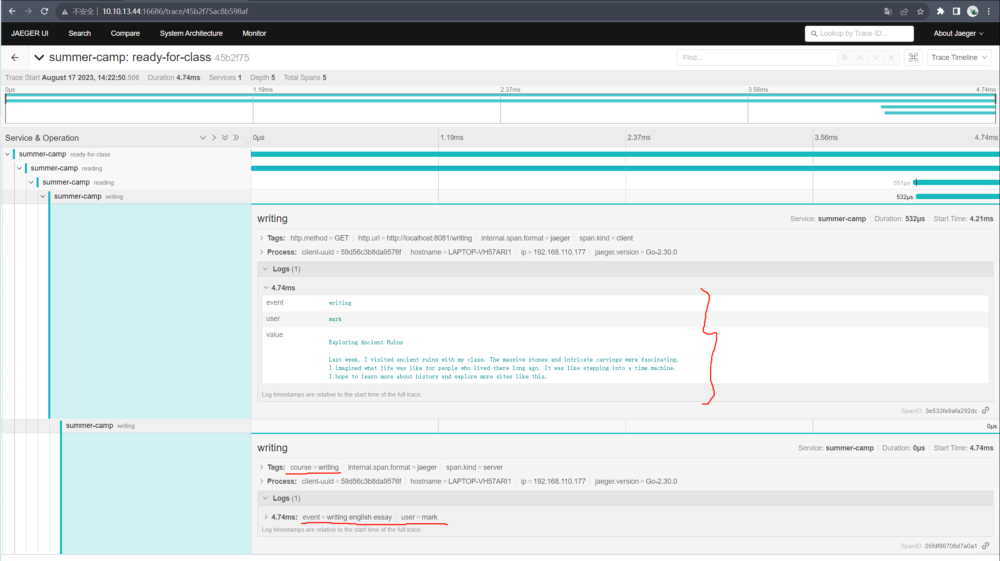

## 安装jaeger

```shell
docker run -d --name jaeger \
  -e COLLECTOR_ZIPKIN_HOST_PORT=:9411 \
  -e COLLECTOR_OTLP_ENABLED=true \
  -p 6831:6831/udp \
  -p 6832:6832/udp \
  -p 5778:5778 \
  -p 16686:16686 \
  -p 4317:4317 \
  -p 4318:4318 \
  -p 14250:14250 \
  -p 14268:14268 \
  -p 14269:14269 \
  -p 9411:9411 \
  jaegertracing/all-in-one:1.47
```

## 运行示例

```shell
$ go run main.go 
2023/08/17 14:22:50 debug logging disabled
2023/08/17 14:22:50 Initializing logging reporter
2023/08/17 14:22:50 debug logging disabled       
welcome to summer camp
2023/08/17 14:22:50 Reporting span 45b2f75ac8b598af:05fdf86706d7a0a1:3e533fe9afa292dc:1
2023/08/17 14:22:50 Reporting span 45b2f75ac8b598af:3e533fe9afa292dc:6d5df3cf058448e5:1
2023/08/17 14:22:50 Reporting span 45b2f75ac8b598af:6d5df3cf058448e5:74d2baa7d1b076f6:1
2023/08/17 14:22:50 Reporting span 45b2f75ac8b598af:74d2baa7d1b076f6:45b2f75ac8b598af:1
2023/08/17 14:22:50 Reporting span 45b2f75ac8b598af:45b2f75ac8b598af:0000000000000000:1
```

日志格式：

Reporting span [TraceID:SpanID:ParentSpanID:Flags]

0000000000000000：代表根 span，没有父 span。

tracing:



细节：




## Reference

[opentracing-tutorial-go](https://github.com/waterandair/opentracing-tutorial)

[opentracing-tutorial-go-py-java](https://github.com/yurishkuro/opentracing-tutorial)

