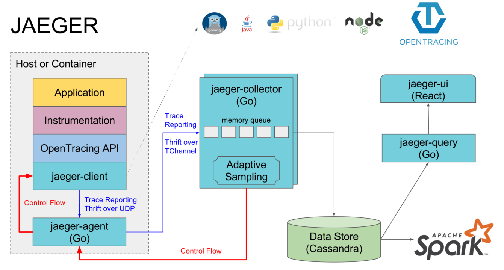

# Jaeger
Jaeger 是 OpenTracing 的一个实现，是 Uber 开源的一个分布式追踪系统，其灵感来源于Dapper 和 OpenZipkin。从 2016 年开始，该系统已经在 Uber 内部得到了广泛的应用，它可以用于微服务架构应用的监控，特性包括分布式上下文传播（Distributed context propagation）、分布式事务监控、根原因分析、服务依赖分析以及性能优化。该项目已经被云原生计算基金会（Cloud Native Computing Foundation，CNCF）接纳为第 12 个项目。

架构图：



## 安装jaeger

```shell
docker run -d --name jaeger \
  -e COLLECTOR_ZIPKIN_HOST_PORT=:9411 \
  -e COLLECTOR_OTLP_ENABLED=true \
  -p 6831:6831/udp \
  -p 6832:6832/udp \
  -p 5778:5778 \
  -p 16686:16686 \
  -p 4317:4317 \
  -p 4318:4318 \
  -p 14250:14250 \
  -p 14268:14268 \
  -p 14269:14269 \
  -p 9411:9411 \
  jaegertracing/all-in-one:1.47
```

## 关键点

### 采样率

支持设置采样率是 Jaeger 的一个亮点，生产环境系统性能很重要，所以对于所有的请求都开启 Trace 显然会带来比较大的压力，另外，大量的数据也会带来很大存储压力。
为了尽量消除分布式追踪采样对系统带来的影响，设置采样率是一个很好的办法。Jaeger官方 支持四种采样类别，分别是 const、probabilistic、rateLimiting 和 remote

- const：全量采集，采样率设置0,1 分别对应打开和关闭
- probabilistic：概率采集，默认万份之一，取值可在 0 至 1 之间，例如设置为 0.5 的话意为只对 50% 的请求采样。
- rateLimiting：限速采集，每秒只能采集一定量的数据，如设置2的话，就是每秒采集2个链路数据
- remote ：是遵循远程设置，取值的含义和 probabilistic 相同，都意为采样的概率，只不过设置为 remote 后，Client 会从 Jaeger Agent 中动态获取采样率设置。

### 跟踪数据 何时、何种时机发送给jager的问题。它是否是 一次完整的请求 就发送给jaeger？(trace report)

在分布式跟踪系统中，跟踪数据是在 Span 结束时发送给 Jaeger 或类似的跟踪后端。这是为了确保已经完成的操作的相关信息都被收集起来。以下是具体的过程：

1. 创建和结束 Span： 在你的应用程序中，每次有一个操作需要被跟踪时，你会创建一个 Span，并在操作结束时（可能是成功完成、失败、异常等情况）调用 span.Finish() 来结束 Span。
2. Span 数据的收集： 当你调用 span.Finish() 结束 Span 时，Jaeger 客户端会将 Span 相关的数据（如开始时间、结束时间、标签、属性等）收集起来。
3. Span 数据的发送： 收集的 Span 数据会被打包成一个跟踪数据包（Trace Packet），然后发送给 Jaeger Collector（或直接到存储后端，具体配置可能会有不同）。
4. Collector 接收和处理： Jaeger Collector 接收到跟踪数据包后，会对其进行解析和处理。它会将 Span 数据存储在后端存储中，以便后续查询和分析。
5. 可视化和查询： 存储在后端的数据可以在 Jaeger 查询界面中查询和可视化。你可以通过查询界面来查看每个请求的跟踪信息，包括整个调用链路、延迟、标签、属性等。

所以，跟踪数据并不是一次完整的请求就立即发送给 Jaeger。它们是在每个 Span 结束时收集，并在一定的时间间隔内发送给 Jaeger。这样可以确保已经完成的操作的相关信息都被收集和记录下来，从而提供对整个分布式系统行为的准确监控和分析。

### 跟踪数据 的 trace report 的流程

1. 创建和配置 Tracer： 在你的 Go 代码中，首先需要创建并配置一个 Jaeger Tracer，这个 Tracer 将用于创建和管理 Span。
2. 创建 Span： 在你的代码中，每当有一个需要跟踪的操作时，你会通过调用 Tracer.StartSpan 方法来创建一个 Span。Span 表示一个操作的时间范围，可以是一个函数、一个请求、一个操作等。
3. 操作和标记 Span： 一旦 Span 被创建，你可以在代码中通过 span.LogKV 方法添加日志、通过 span.SetTag 方法添加标签，以及通过 span.SetBaggageItem 方法添加 baggage 数据。这些操作都会在 Span 中添加额外的信息，以便更好地理解操作的上下文和性能。
4. 结束 Span： 当操作完成时，通过调用 span.Finish 方法结束 Span。在这一步，Jaeger 会记录 Span 的结束时间，并将 Span 的数据收集起来。
5. Span 数据的发送： 一旦 Span 被结束，Jaeger 客户端会将 Span 相关的数据（如 Span 的名称、开始时间、结束时间、标签、属性等）收集起来，并将这些数据打包成一个跟踪数据包（Trace Packet）。
6. Collector 接收和处理： 收集的跟踪数据包会被发送给 Jaeger Collector，它会接收这些数据并进行解析和处理。Collector 将跟踪数据存储在后端数据库中，以供查询和分析。
7. 查询和可视化： 存储在后端的数据可以在 Jaeger 查询界面中查询和可视化。你可以通过查询界面来查看每个请求的跟踪信息，包括整个调用链路、延迟、标签、属性等。

## 运行示例

```shell
$ go run main.go 
2023/08/17 14:22:50 debug logging disabled
2023/08/17 14:22:50 Initializing logging reporter
2023/08/17 14:22:50 debug logging disabled       
welcome to summer camp
2023/08/17 14:22:50 Reporting span 45b2f75ac8b598af:05fdf86706d7a0a1:3e533fe9afa292dc:1
2023/08/17 14:22:50 Reporting span 45b2f75ac8b598af:3e533fe9afa292dc:6d5df3cf058448e5:1
2023/08/17 14:22:50 Reporting span 45b2f75ac8b598af:6d5df3cf058448e5:74d2baa7d1b076f6:1
2023/08/17 14:22:50 Reporting span 45b2f75ac8b598af:74d2baa7d1b076f6:45b2f75ac8b598af:1
2023/08/17 14:22:50 Reporting span 45b2f75ac8b598af:45b2f75ac8b598af:0000000000000000:1
```

日志格式：

Reporting span [TraceID:SpanID:ParentSpanID:Flags]

0000000000000000：代表根 span，没有父 span。

tracing:


细节：


## Reference

[opentracing-tutorial-go](https://github.com/waterandair/opentracing-tutorial)

[opentracing-tutorial-go-py-java](https://github.com/yurishkuro/opentracing-tutorial)

